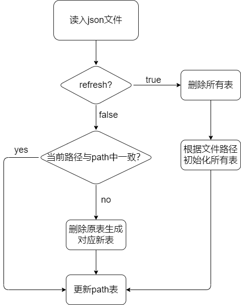

# deb2rpm
[TOC]
## 1. 需求
1. 功能需求：将deb软件包转换为能够在openEuler 22.03-LTS上运行的rpm软件包以及src.rpm源码包
2. 兼容需求：转换出的rpm软件包和包含spec文件的src.rpm源码包，要能在openEuler及openEuler的衍生发行版上正常构建和运行
3. 自动化需求：转换工具能够通用性自动化地转换大部分deb软件包

## 2. 需要解决的困难
1. deb软件包和rpm软件包的文件结构和部分语法不同，需要进行内容的映射，部分独有的内容需要特殊处理
2. deb软件包和rpm软件包使用两套包管理器，其依赖对象不同，需要进行依赖的映射

## 3. 方案总体设计
### 3.1 spec模板
rpm包的关键内容就是spec文件，spec文件的基本格式如下：
```spec
##################################################################
# 1. 元数据信息
##################################################################
Name:
Version:
Release:
Summary:
License:
URL:
Source0:
...
Patch0:
...

%description

##################################################################
# 2. 依赖信息
##################################################################
BuildRequires:
Requires:
...

##################################################################
# 3. 安装信息
##################################################################
%prep

%build

%install

##################################################################
# 4. 子包信息
##################################################################
%package -n <subpackage_name>
Summary:
Requires:

%description -n <subpackage_name>

##################################################################
# 5. 文件信息
##################################################################
%files
...

%files -n <subpackage_name>
...

##################################################################
# 6. changelog
##################################################################
%changelog
...
```

### 3.2 类图
要从不同文件的不同位置提取出以上构建spec文件的内容，本工具中包含的类的总体设计如下图所示：

上图中各个类的基本功能如下：
- `DscParser`：解析dsc文件，获取主软件包的元数据信息
- `ControlParser`：解析control文件，获取子包的元数据信息
- `LicenseParser`：解析license文件，获取license信息
- `DebFiles`：获取文件信息
- `Spec`：将获取到的deb信息转化为spec文件的格式
- `BaseDB`: 调用sqlite数据库的接口
- `SourceDB`：从Source文件(如[https://repo.huaweicloud.com/ubuntu/dists/jammy/main/source/Sources.gz](https://repo.huaweicloud.com/ubuntu/dists/jammy/main/source/Sources.gz))构建数据库
- `PackageDB`：从Package文件(如[https://repo.huaweicloud.com/ubuntu/dists/jammy/main/binary-amd64/Packages.gz](https://repo.huaweicloud.com/ubuntu/dists/jammy/main/binary-amd64/Packages.gz))构建数据库
- `InitDB`: 获取源文件及依赖的数据库

类与spec文件内容的对应关系如下：
| 类 | spec |
| :---: | :---: |
| InitDB | 依赖相关 |
| DscParser | Name, Epoch, Version, Release, URL, Source |
| ControlParser | Summary, %description, 子包名 |
| LicenseParser | License |
| DebParser | Patch |
| DebFiles | %build, %files |
| SpecGenarator | %prep, %install, %changelog |

### 3.3 整体流程
1. 初始化或更新数据库信息
2. 在`SOURCES`目录下创建与软件包同名的文件夹，并根据数据库中的源文件信息获取deb源码包，并解压得到源码文件夹
3. `DscParser`解析dsc文件获取主软件包的元数据信息
4. `ControlParser`解析control文件获取子包的元数据信息
5. `LicenseParser`解析license文件获取license信息
6. 从debian/patches文件夹中获取补丁文件并复制到步骤二创建的文件夹中
7. 调用`get_files`脚本获取安装文件列表
8. 将元上述信息转化为spec中对应的内容
9. 生成spec文件
10. 将Source和Patch文件复制到`SOURCES`中，并删除步骤二创建的文件夹

## 4. 具体实现
下面按照spec文件的各个模块来介绍具体的实现方法。
### 4.1 Source和依赖相关内容
本部分是从Source文件和Package文件中的已有内容获取的，用户通过改写`resources.json`文件中的文件路径来设置使用的本地文件，该json文件模板如下：
```json
{
    "refresh": false,
    "Sources": {
        "main": "/path/to/main/source",
        "multiverse": "/path/to/multiverse/source",
        "restricted": "/path/to/restricted/source",
        "universe": "/path/to/universe/source"
    },
    "Packages": {
        "main": "/path/to/main/package",
        "multiverse": "/path/to/multiverse/package",
        "restricted": "/path/to/restricted/package",
        "universe": "/path/to/universe/package"
    }
}
```
为了减少重复的读写并方便做设置修改，数据库中除了将以上八个文件分别对应到八张表，还另设一张表用于存储文件路径信息。当json文件中某个文件的路径信息被修改了后，再次运行程序前会将对应的表更新为新文件，数据库初始化部分的流程图如下：

数据库存储内容如下：
- path表： source和package文件路径信息
- SourceMain, SourceMultiverse, SourceRestricted, SourceUniverse:
存储Source文件中后续需要的信息，包含源码包所在源的文件夹、构建依赖(*Build-Depends*)、所需要的源文件
- PackageMain, PackageMultiverse, PackageRestricted, PackageUniverse:
存储Package文件中后续需要的信息，即各个软件包(包括子包)的依赖信息，包括`Provide`, `Pre-Depends`, `Depends`, `Recommends`, `Suggests`, `Breaks`, `Replaces`

完成了数据库内容的获取，就可以将获取信息的接口`get_source_info`和`get_package_info`封装到`InitDB`类中了。

### 4.2 构建build目录
获取到source信息后，工具就会在`SOURCES`目录下的临时文件夹中下载这些文件：
```python
source_name, build_requires, dir_path, source_files = get_source_info(package_name)

web_repo = "https://repo.huaweicloud.com/ubuntu"
for file in source_files.split():
    os.system(f"wget {web_repo}/{dir_name}/{file}")
```
随后执行命令`dpkg-source -x --no-check <dsc_name>`来构建源码文件夹(build目录)。相比于`tar`的相关解压方式，该方案的优势在于：
- 无需考虑源码压缩包的多种压缩文件格式
- 无需考虑解压路径的设置
- 可进行任意数量的文件解压
- 作为`apt source`的实际命令之一，`dpkg-source -x`会自动执行`debian/patches/series`中列出的补丁文件

### 4.3 Name, Version, URL, Sources
本部分内容由`DscParser`提取，由于dsc文件格式较为统一，因此这里使用了一个简单的信息提取函数：
```python
def get_line_info(line: str) -> List:
    pattern = r'^(.*?):\s*(.*)'
    match = re.search(pattern, line)
    if match:
        return match.group(1).strip(), match.group(2).strip()
    return "", ""
```
即如果一行字符串为
```
Version: 1.0.0
```
该函数就会返回`["Version", "1.0.0"]`，从而提取出需要的信息。

后续在`Spec`类中会对`Version`信息做进一步处理，因为deb中`Version`的格式为`[Epoch:]Version[-Release]`，分别对应spec中的三个字段，其中`Epoch`和`Release`是可选的，在本工具中`Epoch`默认为无，`Release`默认为`1`

这里不从source文件而从dsc文件中获取这些信息的原因在于减少对于数据库的依赖，并且为将一个未收集信息的deb包转换为rpm包提供可能。

### 4.4 %package, BuildArch, Summary, %description
本部分内容由`ControlParser`获取，control文件格式类似于dsc文件，因此也可以采用`get_line_info`的方法。但`Summary`和`%description`信息有所不同，在control文件中，前者对应`Description`字段的第一行内容，后者对应该字段的剩余内容，而该字段后的内容要么就是下一个Package，要么就是文件结尾，因此可以如下处理：
```python
with open(path, 'r') as file:
    package_name = ""
    description = ""

    for line in file:
        key, value = get_line_info(line)
        if key == "Package":
            description = False
            package_name = value
            self.package_data[package_name] = {}
        if key == "Description":
            self.package_data[package_name].update({"Summary": value})
            description = True
            self.package_data[package_name]["description"] = ""
        elif description:
            self.package_data[package_name]["description"] += line
```

### 4.5 License
本部分由`LicenseParser`提取，根据deb包license文件的格式[规范](https://www.debian.org/doc/packaging-manuals/copyright-format/1.0/)，该文件总体的格式大致为：
```
Files: *
Copyright: 1975-2010 Ulla Upstream
License: GPL-2+

Files: debian/*
Copyright: 2010 Daniela Debianizer
License: GPL-2+

Files: debian/patches/fancy-feature
Copyright: 2010 Daniela Debianizer
License: GPL-3+

Files: */*.1
Copyright: 2010 Manuela Manpager
License: GPL-2+``
```
此处仅提取了`Files: *`下的`License`字段值填写spec文件中对应的`license`名。
但也存在不满足这种规范的软件包，如`zip`。由于spec文件中`license`字段不可缺少，暂时将这种软件包的`license`填写为MIT

### 4.6 Patch
本部分内容由`DebParser`获取。如前所述，补丁文件在构建build目录时会自动执行，因此在spec文件中并不需要手动执行补丁，但仍然需要列出补丁文件。事实上，deb包的补丁文件均在`debian/patches`文件夹下，因此只需获取该目录下所有的`.patch`和`.diff`文件即可。

### 4.7 %build, %files
本部分内容由`DebFiles`获取，由于deb包并不像rpm包这样显式地列出待安装目录，而是将各子包的待安装目录先安装在debian目录下。因此本工具会在`SOURCES`目录下创建的临时文件夹中完成deb包所有文件结构的构建，进而获取到各子包需要安装的文件。

尝试发现，在执行`fakeroot debian/rules binary`时，不同的包会执行不同的命令，但如果在中间插入无关的指令实际上并不会产生别的影响。因此，可以先确定一个通用的有序的全体命令集。

另一方面，`debian/rules`文件中可能含有部分命令的重载，如`override_dh_auto_install`，这时就需要将全体命令集中的`fakeroot dh_auto_install`替换为`fakeroot debian/rules dh_auto_isntall`。
有时也存在两个替换的情况，即`fakeroot dh_install`替换为`fakeroot debian/rules dh_install-arch`和`fakeroot debian/rules dh_install-indep`。

通过对`debian/rules`文件的解析，就能获得文件信息的全部命令，也就是`%build`对应的内容。

### 4.8 %prep, %install
这两部分内容相对固定，由`SpecGenarator`类直接写入。
`%prep`部分需要实现源码压缩包的解压，类似[4.2构建build目录](#42-构建build目录)中的阐述，本工具使用`dpkg-source`实现解压，具体如下：
```spec
%prep
cd %{_sourcedir}     # prep阶段默认开始位置是build目录
rm -rf %{_builddir}/%{name}-%{version}
dpkg-source -x --no-check /path/to/dsc %{_builddir}/%{name}-%{version}
```
从而实现了rpm默认的build行为，即在`%{_builddir}`下创建名为`%{name}-%{version}`的目录，并在其中完成build
由于本阶段没有使用`setup`等默认的宏，因此`%build`的默认路径仍然是`%{_builddir}`, 因此需要在`%build`阶段最开始加上`cd %{name}-%{version}`

`%install`部分需要实现的是将待安装文件全部复制到`%{buildroot}`目录下，由于需要实现的是文件树结构的复制，本工具采用的是`rsync`命令：
```spec
rm -rf %{buildroot}/*
rsync -a --ignore-existing --exclude='DEBIAN/' %{_builddir}/%{name}-%{version}/debian/<package1>/* %{buildroot}/%{name}-%{version}-{release}.<arch>
...
```

### 4.9 %changelog
本部分内容暂时为统一格式，模板如下：
```spec
%changelog
* <星期> <月份> <日> <年份> OpenEuler <community@openeuler.org> %{version}-%{release}
- Build %{name} from deb to rpm
```