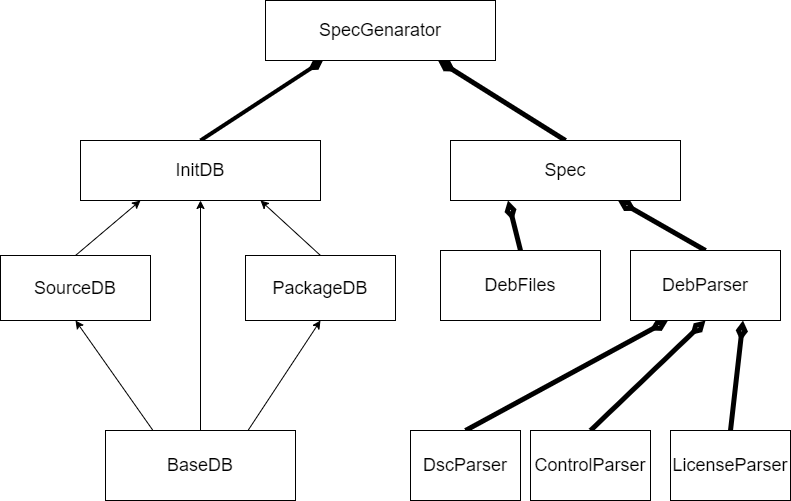

# deb2rpm
本部分完成了在Ubuntu环境下deb源码包生成对应spec文件，从而构建rpm包及rpm源码包。其中类的设计如下图所示：

## 整体流程
0. 在`~/rpmbuild/SOURCES`文件夹下创建源代码文件夹，并在该文件夹下调用`apt source`
1. `DscParser`解析dsc文件获取主软件包的元数据信息
2. `ControlParser`解析control文件获取子包的元数据信息
3. `LicenseParser`解析license文件获取license信息
4. 从debian/patches文件夹中获取补丁文件并复制到源代码文件夹中
5. 调用`get_files`脚本获取安装文件列表，并完成build
6. 将元数据信息转化为spec中对应的内容
7. 生成spec文件
8. 将待安装文件目录复制到BUILDROOT中(即`%install`)
9. 将Source和Patch文件复制到SOURCES中

## 测试结果
在Ubuntu 20.04环境下，对`apache2`、`nginx`、`redis`、`ffmpeg`、`tmux`、`nghttp2`、`zip`、`dh-python`进行了测试，均能够成功构建出rpm包及rpm源码包。

## 部分待处理细节
1. **License的提取:** 目前忽略了子软件包可能存在的不同License，并且对于特殊的License文件格式未处理，默认为MIT，如zip
2. **BuildArch:** 忽略了`BuildArch`的内容，因为使用`noarch`在建包时可能会出现有架构要求的二进制文件而出错的情况，如nghttp2

## 迁移到openEuler需要解决的问题
1. **源码包**：源码包对应文件可以在Source池中查询，由于该文件较大，可以考虑事先存储在数据库中
2. **依赖**：需要填写依赖相关字段